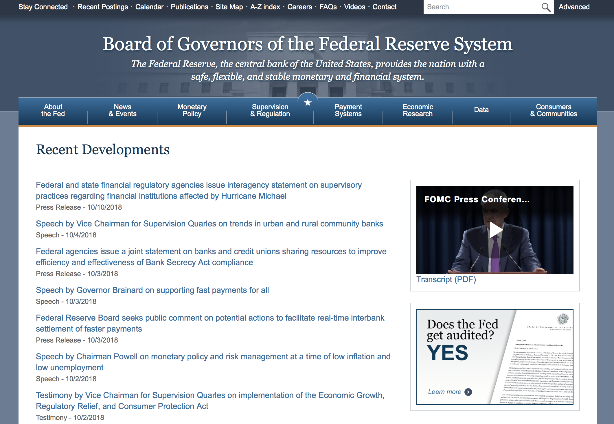
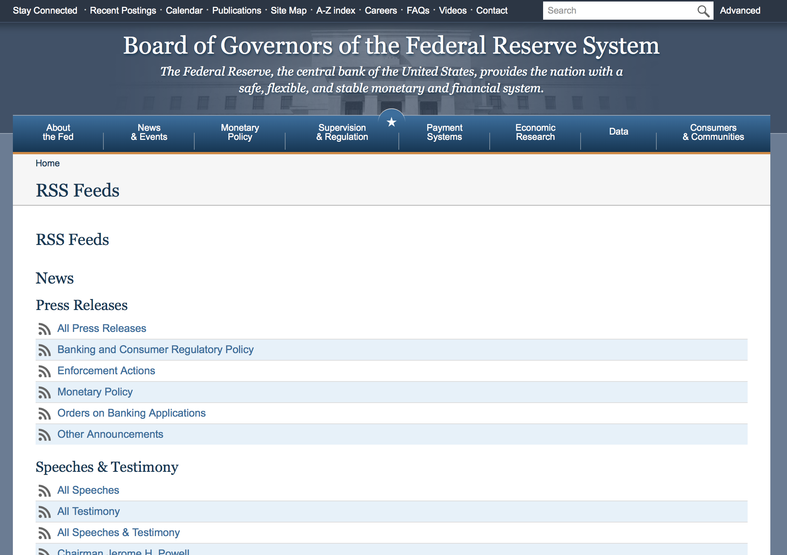
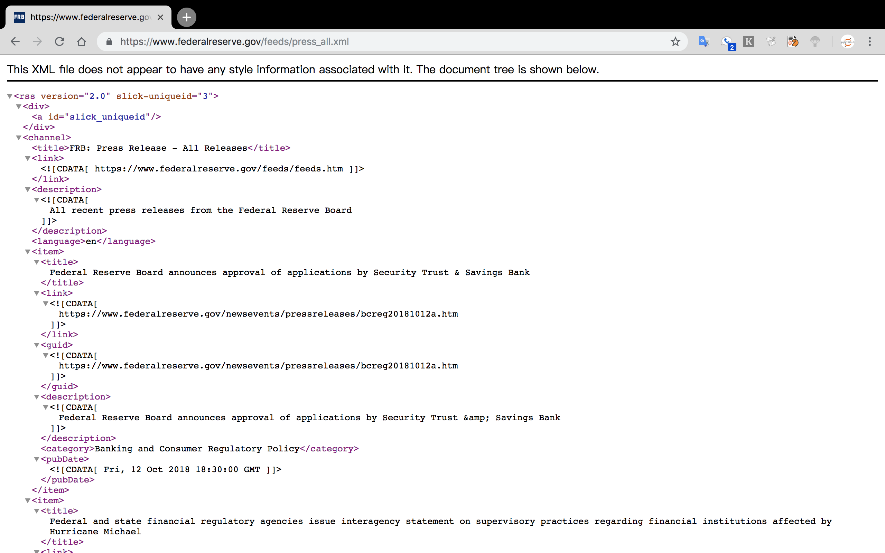

# Fintech 2018 assignment 1
---

## 背景：

### **任务： 及时了解美联储官网上的发布的货币政策信息。**

由于美联储官网上货币政策相关的信息的发布是不定时的，对于什么时间发布我们无法预知，这就决定了我们常常无法在第一时间就或者其发布的最新政策信息，而只有我们自己动手去浏览网站时才能知晓。这种模式也是我们访问互联网的常见模式，可以简单理解为一种“拉”（pull）的方式，就是说需要我们自己主动去访问网站才能获得；（这种可以理解为以"网站为中心"）

除了这种“拉”（pull）的方式，还存在一种叫做“推”（push）的方式，这种方式下，当网站上有新的消息发布时，它可以通过邮件、消息订阅等方式直接将信息告诉给用户（你有新的消息了），这样，用户不需要访问网站或者可以在其邮件中或者消息中直接点击链接就可以看到新的消息和内容信息。（这种可以理解为是以"用户为中心"）

采用pull还是push，这是一个问题，也是一个难题。

因为，这不仅涉及到一定的网络技术、网络资源等的设计和利用，还与用户的行为习惯、用户心理等有关系，这是一个没有标准答案的问题。

针对我们的任务，我们需要了解：

1. 网站的设计是采用的pull还是push的方式？
2. 如果是pull方式，则我们需要访问哪些网页，需要多少时间？以什么样的频率才能达到？这些工作我们可以在哪些工具上完成（电脑/手机）？这些工具完成的效率如何？
3. 如果是push方式，则我们如何获取push的通知？我们需要准备什么工具？这些工作我们可以在哪些工具上完成（电脑/手机）？这些工具完成的效率如何？
4. 为了完成这个任务，我预计每天需要花费多少时间（精力）
5. 我对采用的完成此任务的工具和方式，是否感到满意？如果不满意，主要表现在哪些方面：
  - [ ] 电脑/手机操作速度太慢
  - [ ] 网速太慢
  - [ ] 手机阅读不方便
  - [ ] 不知道什么时间有更新，只有每天有空就上官网查看，有焦虑感
  - [ ] 每次上去都发现没有更新，有失落感和无助感
  - [ ] 在没有网络的情况下，对于已经发布的信息也无法查看到
  - [ ] ……
  
6. 我完成这个任务的方式是有效率的吗？有没有更好的方式来解决我的不满意？

通过对任务的分析，我们希望通过python编程，来尝试提供一种解决的方式。

我们计划设计提供一个网站（页面），集中展示我们需要的内容。这些内容是我们通过编程，让计算机自动地定时（如可以设置为每30分钟）去美联储的官网上去查看有没有更新的信息发布，如果有，就下载下来，放在我们的网站（页面上），这样我们只需要访问我们的网站（页面）就可以了（还是一种pull的方式，只不过这个网站是对源网站的信息过滤和整理后的内容呈现）；

如果可能，我们还希望能设计和提供我们的网站（页面）的API接口，这样有助于通过其他应用来调用，比如微信，QQ等，也可以每当有信息更新时，网站自动给我们发一份邮件或者短信（包括访问地址），告诉我们有信息更新了，我们可以直接看到更新的信息或者直接点击链接就可以看到最新的信息。（这是一种push的方式，让我们可以更加主动地得到通知）

虽然我们的网站仍然是一个需要我们主动访问才能获取信息的方式（pull），但如果当我们的任务扩展到要去多个网站获取相关的信息时，我们的网站（页面）就成为了多种信息的一个汇集点（hub），这有助于我们集中在一处就可以解决我们的问题，这也是有效率的。

当然，采用push的方式，可以让我们更加自由方便地获取信息，且减少了我们主动去查看网站带来的焦虑感、失落感和无助感，这无疑对于我们来说是更加有效率的事情。

我们就来尝试一下，看看我们能否完成？

我们希望的成果：
1. **基本**：一个网站或者一个页面（单页面网站）：便于我们集中查看信息，代替我们到（多个）网站上去查看；

2. **扩展**：
  - 网站的API，可通过微信访问
  - 邮件通知，每当新信息下载后，自动发送新信息的内容或链接到用户的电子邮箱；
  - 消息通知，每当新信息下载后，自动发送短信到用户的手机上

我们先来完成我们的基本任务。如果可能，我们可以进一步去完成扩展任务，让我们更加有效率地完成任务，减少我们的焦虑。

---

## 实验项目：

## 实验目标：

### 1. 数据获取能力：

  #### 1.1 数据获取：
  - [ ] 了解和学习如何使用python来实现从美联储网站**抓取**特定的网页；
    - 通过网页分析，通过对网页代码的分析了解网页文件的类型（html/html5/xml）
    - 了解和学习如何通过urllib库的request来获取一个html格式的网页的内容（html，选择不同的参数实现，"html/html5"）
    - 了解和学习如何通过urllib库的request来获取一个xml格式的网页内容（rss，选择不同的参数来实现，"xml/lxml"）
    - 了解和学习如何使用BeautifulSoup包来对html/xml文件进行快速的处理分析，提取所需要的内容

  - [ ] 了解和学习如何使用python来实现从美联储网站**抓取**其有关货币政策的网页（一系列或者一批网页）；
  - [ ] 了解如何如何使用python来实现**自动定时**地从美联储网站抓取其有关货币政策的网页（一系列或者一批网页）；
  - [ ] 扩展：了解和学习如何使用python来实现**自动定时**地从美联储网站抓取**其他**主题的系列网页：

  - 使用工具：
    - python3
      - urllib.request (urlopen)
      - bs4 (BeautifulSoup)

 #### 1.2 数据处理和保存

   数据处理分析包括在数据获取过程中，对抓取数据的分析处理，这里主要是从网页中找到我们所需要的内容，删除其他不必要的网页内容（比如其他链接和footer部分等，也包括去掉愿网页的一些css样式等）；另一方面，主要是对于内容信息的分析，按照内容的类别和属性进行分类，包括时间、作者（或者机构）、文章标题，文章链接地址等。对于这一部分的分析处理，目的是尽可能地得到纯文本的信息，去掉多余的格式等，又能针对后面的内容呈现进行必要的数据准备，主要是完成一些结构化的处理，便于后期的数据库存储和按属性查询。

 - [ ] 保存为文本文件（txt）
 - [ ] 保存为cvs格式的文件
 - [ ] 保存为sqlite数据库文件
 - [ ] 保存为其他数据库文件（mysql……）
 - [ ] 保存在内存中

 - [ ] 了解和学习如何通过python实现文件的读取和写入；
 - [ ] 了解和学习如何通过python的cvs包来实现csv格式文件的读取和写入；
 - [ ] 了解和学习如何通过python的pandas包实现文件的读取和写入；
 - [ ] 了解和学习如何通过sqlalchemy包来建立数据库引擎，执行sql命令来写入数据库，将数据存储在数据库中。

 使用工具：
  - cvs库
  - pandas库
  - sqlalchemy

### 2. Web应用的建立
  在上一部分，我们完成了数据的抓取，通过对页面的分析，我们获取了需要下载页面的链接地址，通过对链接地址的页面下载处理分析（主要是通过BeautifulSoup库），我们从中提取出我们想要的文章内容（node="main" or id="article"），并将结果存储为文件，同时也保存在在数据库中。
  这个过程，我们通过对半结构化的数据进行抓取和处理，将数据从半结构化转化为结构化，这样对于后续的处理将更加方便。
  > 如果数据库选用SQL类型的数据库，如sqlite，则需要将数据结构化；
  > 如果数据库选用NoSQL数据库，如MongoDB，则数据将仍以半结构化方式存储，是一种类json的格式；

  这部分，我们主要的目标是将数据以我们的需求重新组织后展现出来。这样做的好处在于：
  1. 数据可以按照我们希望的格式或者样式来展示
  2. 我们可以让我们采集的数据集中在一个网站或者网页展现，而不用频繁地访问多个网站或者多个页面，这有助于提高我们的效率。
  3. 我们可以按照我们的要求来决定内容以什么方式提供给什么人看，也就是说可以实现更加个性化的需求，展现的内容因人而异；

  简单来说：

  1. 更加**方便**地阅读
  2. 更加**有效率**地阅读
  3. 更加**个性化**地阅读

 - [ ] 了解和学习SQL语言
 - [ ] 了解和学习SQL数据库的使用，比如sqlite
 - [ ] 了解和学习NoSQL语言的使用，比如MongoDB
 - [ ]  了解基本的HTML语法和用法
 - [ ] 

## 开始

### Step 0. 环境的准备

 - 操作系统
 - python软件安装（annaconda）
 - 虚拟环境的建立
 - git的安装
 - python库文件的安装和检查（requirements.txt文件，pip install -r requirements.txt）

### Step 1 数据抓取

#### Step 1.1 数据抓取1（页面分析）

3.1.1 浏览目标网站（美联储的网站）

目标网站地址：https://www.federalreserve.gov

我们继续浏览该网站，查看有关金融政策的信息。

[RSS Feeds](https://www.federalreserve.gov/feeds/feeds.htm)

我们用浏览器进一步查看这些RSS链接，比如我们来看看其中所有的press RSS信息，它是一个`XML`格式的文件，在浏览器中看起来是这样的：

这是一个结构化的信息，我们不难看到每一个**网页的链接地址**。

<h3 style="color: orange">这里面的**网页链接地址**正是我们所需要的结果。</h3>我们将通过这些网页链接来下载相关的网页内容，并保存下来，用来建立我们自己的网站（网页）。

>

> **What is an RSS feed?**

> RSS, or "Really Simple Syndication" is an XML-based format for distributing web content. Users can subscribe to RSS feeds using software such as readers, or aggregators, which display the links, headlines, and a brief summary of the feed. The reader automatically incorporates changes for RSS subscribers when content in the feed has been updated or changed.

> **How do I use RSS feeds from the Fed?**

> You will need to use software that acts as a reader, or aggregator, to view the feed. This may include some web browsers, e-mail programs, and web-based tools. For a standalone reader, searching for "RSS reader" in a search engine should provide many options. Most readers require the web address, or URL, for the feed in order to display the RSS. Selecting the orange RSS button on the site will display the content in a formatted manner, but you will still need to copy the URL from your browser and supply it to the reader so it will know where to find the information.

#### Step 1.2 数据抓取2（抓取页面的下载链接，保存为工作文件或者list）

可以参照我提供的样例，自己完善。

<请同学们根据你们的具体实验补充本部分>

#### Step 1.3 数据抓取3 （下载网页，将所需要的内容存放在数据库或者文件中）

<请同学们根据你们的具体实验补充本部分>

### Step 2： 根据rss的网页链接抓取网页内容

<请同学们根据你们的具体实验补充本部分，将抓取的内容如上要求进行本地化存储。>

### step 3:  根据抓取的内容，发送邮件或者短息通知给自己

**本部分为选项内容，同学们可以根据自己的能力选择是否去实验和完成。**

发送邮件或者短信可参照提供的样例。此部分，需要同学查找资料，如何在python中实现自动检查和自动定时任务。

<请同学们根据你们的具体实验补充本部分>

### Step 4：将python程序转换为web 应用

采用python的微框架Flask完成此部分实验。

**本部分需要在本地环境中实施完成。为选项内容，同学们可以根据自己的能力选择是否去实验和完成。**

需要了解：
 - Flask app的准备

 - flask的安装
 - app的工作方式和目录结构

 - templates模版文件的建立
 - models的建立
 - views的建立
 - routes的建立
 - blueprinte蓝图方式
 - 工厂模式（OOP）
 
需要实验内容： 
 

<请同学们根据你们的具体实验补充本部分>

### Step 5 创建 RESTful API

**本部分需要在本地环境中实施完成。为选项内容，同学们可以根据自己的能力选择是否去实验和完成。**

<请同学们根据你们的具体实验补充本部分>

### 总结

<请同学们根据你们的具体实验补充本项目实施后的感受>

